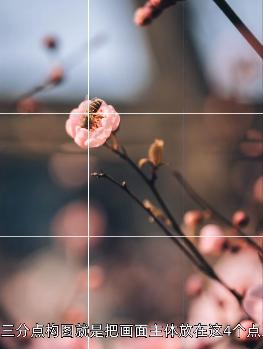
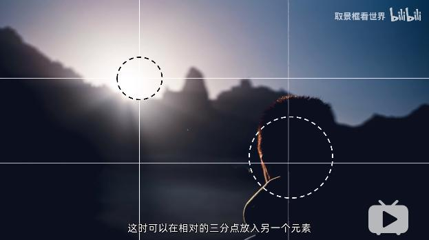
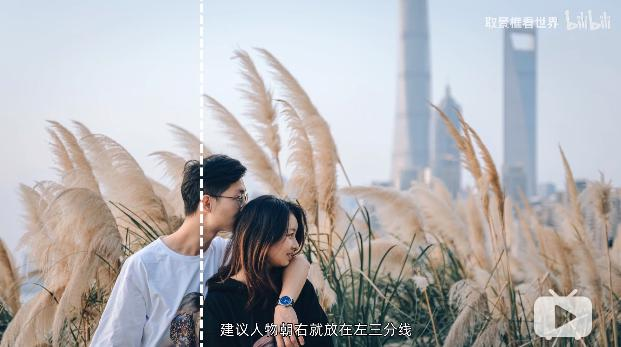
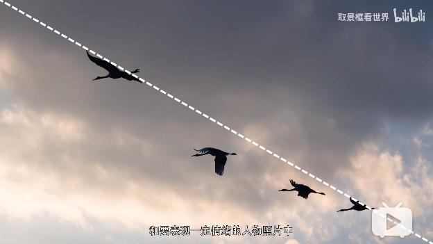
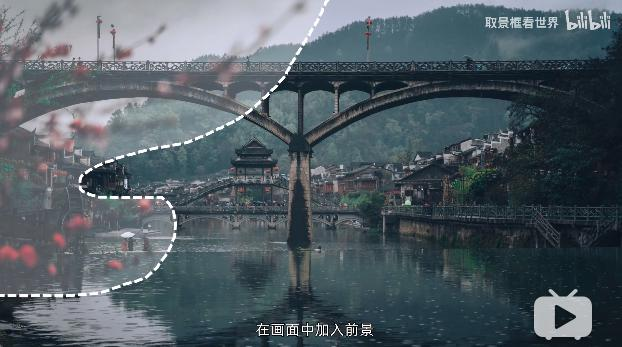
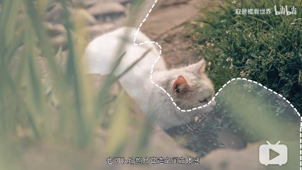
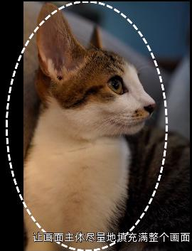
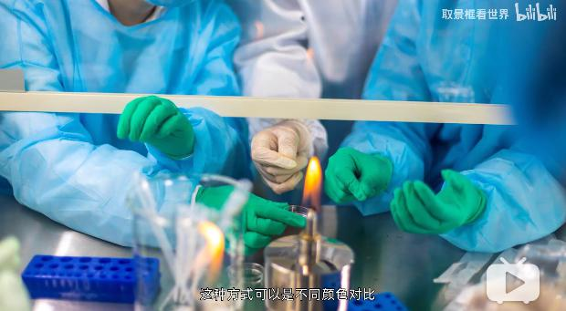
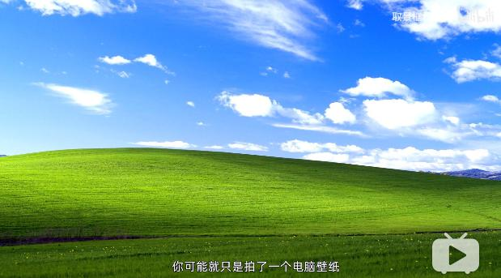
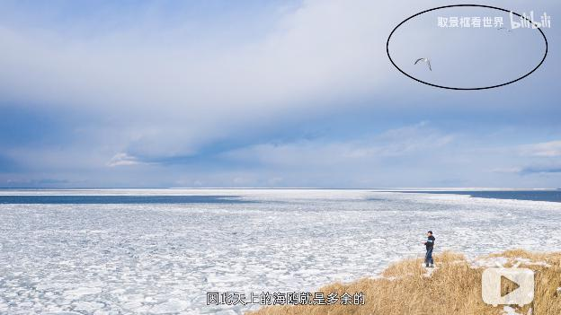

<!--
+++
title       = "摄影入门"
description = ""
date        = "2020-05-24"
weight      = 3
tags        = []
categories  = ["9-hobbies"]
keywords    = []
+++ -->

[TOC]

## 1. 硬件

### 1.1. 感光

硬件cmos: 镜头下的“小面板”

控制参数

* 光圈: 一组扇叶控制进光量（F1.2-F22)
* 快门: 门帘开合时间（3"-1/8000)
* ISO: 通过电子信号，但会影响画面质量（增加颗粒感）
    - range: 100-25600

## 2. 技巧

### 2.1. 构图
> [Bilibili: 6分钟让你学会构图，拍照萌新变摄影大师](https://www.bilibili.com/video/BV1Q64y1T7ox?from=search&seid=9417502762956421474)

#### 2.1.1. 中心点构图

+ 稳重
+ 呆板、缺乏活力

    

#### 2.1.2. 三分点构图

+ 更加富于变化
+ 注意：可以通过辅助线功能（九宫格）

    

+ 可以引入另一元素来**平衡画面**

    

#### 2.1.3. 中心线构图

#### 2.1.4. 三分线构图

+ 垂直三分线构图拍摄人像时，要留意人物朝向

    

#### 2.1.5. 对角线构图

+ 横平竖直：稳定安心
+ 倾斜：动感 + 不稳定

    

    

#### 2.1.6. 曲线构图

+ 导向图像中心像素

#### 2.1.7. 前景构图法

+ 有趣
+ 空间立体感

    

    

#### 2.1.8. 填充构图

+ 透视效果
+ 突出效果

    

#### 2.1.9. 留白构图

#### 2.1.10. 排列-重复构图

#### 2.1.11. 对比构图

+ 色彩对比

    

+ 动静对比

    

+ 明暗对比

    

### 2.2. 取景
> [Bilibili: 5分钟学会取景，拍照菜鸟变摄影大神](https://www.bilibili.com/video/BV1c54y1X7hC?from=search&seid=9417502762956421474)

#### 2.2.1. 明确主题，突出主体

没有主体的图片，就是“电脑壁纸”，是没有灵魂的。

#### 2.2.2. 摄影是减法的艺术

+ 颜色搭配：不要超过3种

#### 2.2.3. 加法

通过梅花前景，反映料峭春寒~

#### 2.2.4. 营造陌生感

任何领域，生产（创作）者梦寐以求的，就是“陌生感”，才能脱颖而出。

* 换个取景地点
* 视角
    - 侧视角
    - 后视角
    - 俯视角
    - 仰视角
* 焦距

    

* 取景光线

     摄影是用光 ~~钱~~ **线** 的艺术

    * 侧光
    * 逆光
    * 剪影
