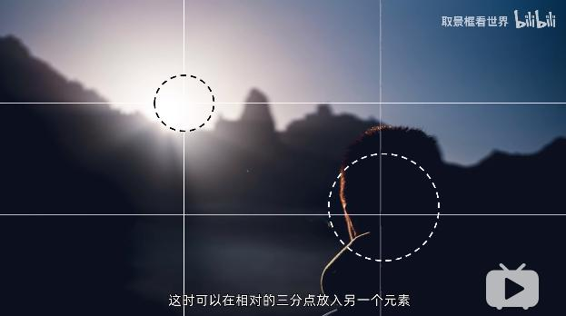

<!--
+++
title       = "摄影入门"
description = ""
date        = ""
weight      = 1
tags        = ["try", "hobbies"]
categories  = ["sth_error"]
+++ -->

# WRONG_TITLE Here

## 硬件

### 感光

硬件cmos: 镜头下的“小面板”

控制参数

* 光圈: 一组扇叶控制进光量（F1.2-F22)
* 快门: 门帘开合时间（3"-1/8000)
* ISO: 通过电子信号，但会影响画面质量，如增加颗粒感（100-25600)

## 技巧

### 2.1. 构图
> [Bilibili: 6分钟让你学会构图，拍照萌新变摄影大师](https://www.bilibili.com/video/BV1Q64y1T7ox?from=search&seid=9417502762956421474)

#### 3.2.1. 中心点构图

+ 稳重
+ 呆板、缺乏活力

    

#### 三分点构图

+ 更加富于变化
+ 注意：可以通过辅助线功能（九宫格）

    

+ 可以引入另一元素来**平衡画面**

    

#### 2.1.3. 中心线构图

#### 1.4. 三分线构图

+ 垂直三分线构图拍摄人像时，要留意人物朝向

#### 对角线构图

* 横平竖直：稳定安心
* 倾斜：动感 + 不稳定
